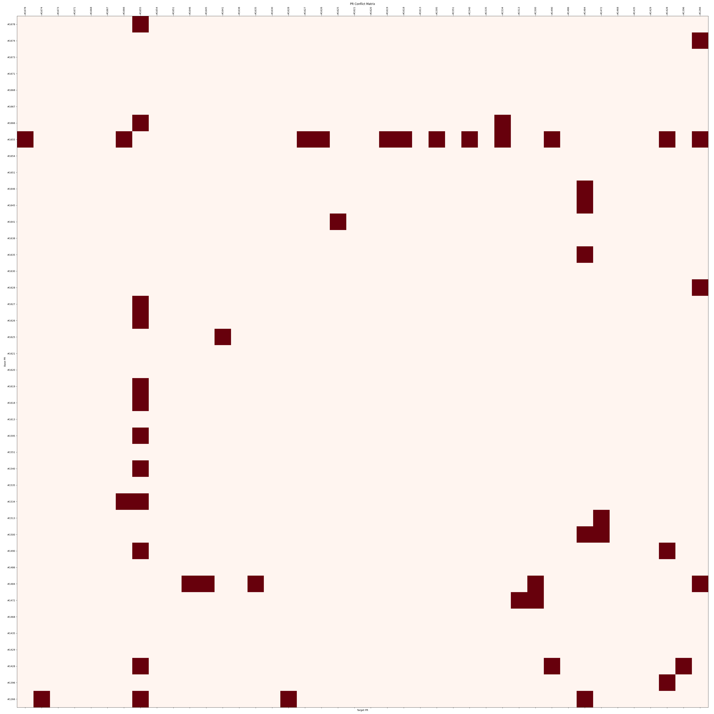

# PR Conflict Checker

This repository contains a Python script that checks for conflicts between open Pull Requests in a GitHub repository. It generates a matrix visualization showing which PRs conflict with each other.

Example:


## Usage

### Running Locally

1. Clone this repository
2. Install dependencies: `pip install -r requirements.txt`
3. Run the script: `python pr_conflict_check.py <repo_url> <github_token>`

Example:
```
python pr_conflict_check.py https://github.com/owner/repo ghp_XXXXXX
```

### Running as GitHub Action

1. Fork this repository
2. Go to the Actions tab in your fork
3. Select "PR Conflict Checker" workflow
4. Click "Run workflow"
5. Enter the repository URL you want to check
6. View the results in the Artifacts section of the Action run

## Output

The script generates:
- A conflict matrix image (`conflict_matrix.png`)
- A log file (`subprocess_log.txt`) containing all git commands and their outputs
